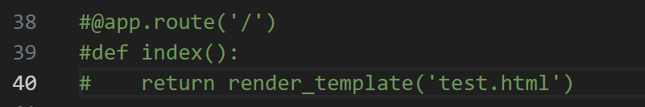
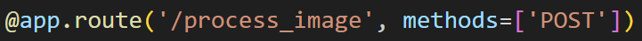
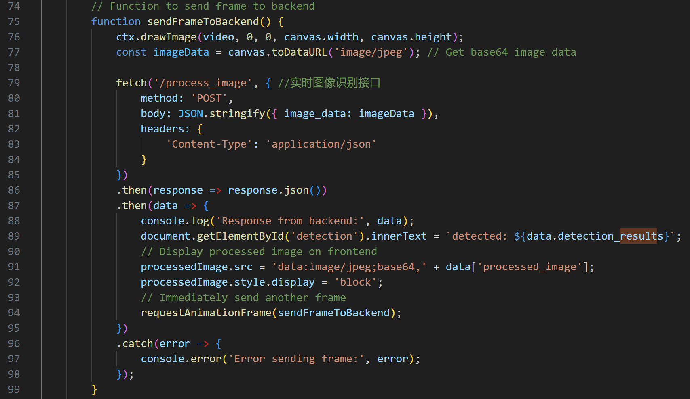
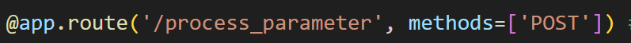
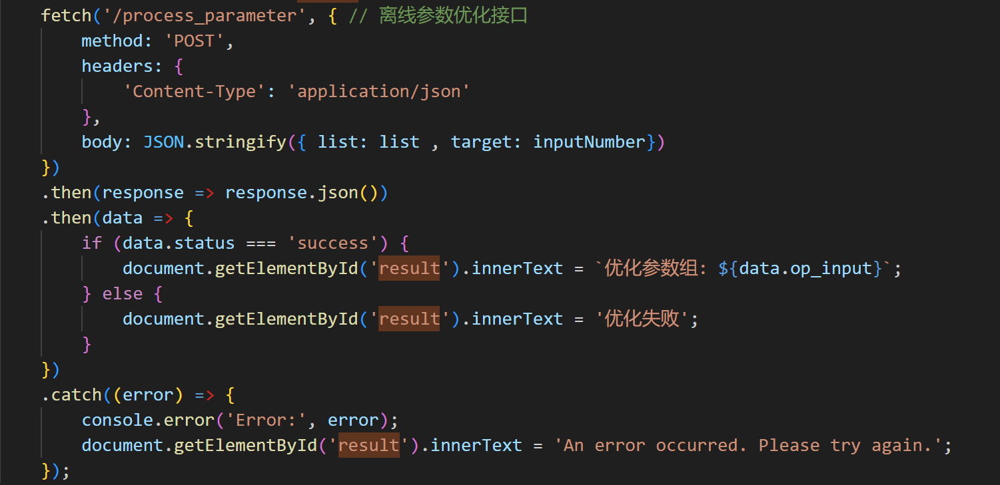

## Setup
### 1. 安装必要模组
##### 推荐在python虚拟环境中运行，安装指令如下（在requirements.txt的路径中）：
#### pip install -r requirements.txt
### 2. 运行 app.py 文件
##### 在backend文件中运行app文件的指令即可开启：
#### python ./app.py
## 使用说明
##### 在运行app.py后即可对应路径发送html请求。
本文件夹包含接口实验前端test.html，在template文件中。如需使用，请去除app.py中此处注释井号：

去除后运行app.py，再进入http://localhost:5000/即可使用实验性前端。
### 传输图像

上方路径对应的函数可逐帧检测图像中的需识别目标，接口方法如下图所例：

在前端向指定路基发送POST请求，内容包括一张为base64格式的图片文件。 
后端对应函数接收后，将对图像进行识别再将处理后的base64图像，fps，检测目标以json data的形式发送回前端，其中data["processed_image"]将得出处理后的图像，data["detection_result"]将得出代表对应识别标签以及其数量的字符串， data[“fps”]为1秒处理的图像数量（与cpu或GPU硬件水平相关）。
### 传输参数

上方路径对应的函数可逐帧检测图像中的需识别目标，接口方法如下图所例：

在前端向指定路基发送POST请求，内容包括一个包含参数的list格式数列，以及个预期目标对应的整数int。 
后端对应函数接收后，将优化参数以json data的形式发送回前端，其中data["op_input"]将得出优化后的参数数列，处理时长与cpu或GPU硬件水平相关。# slm_defect_detector
